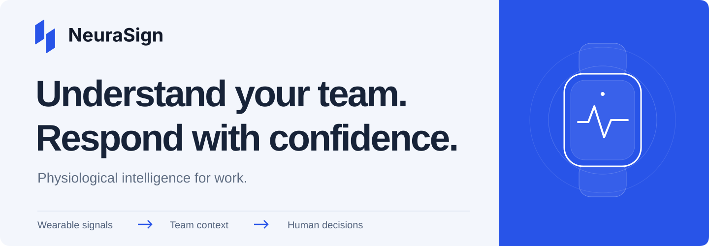
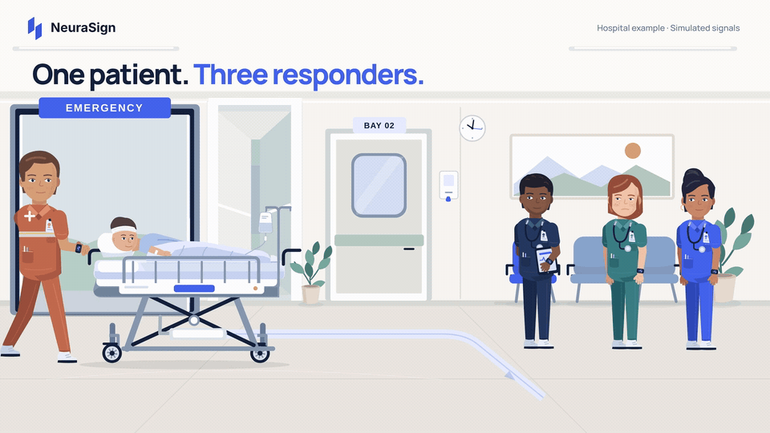
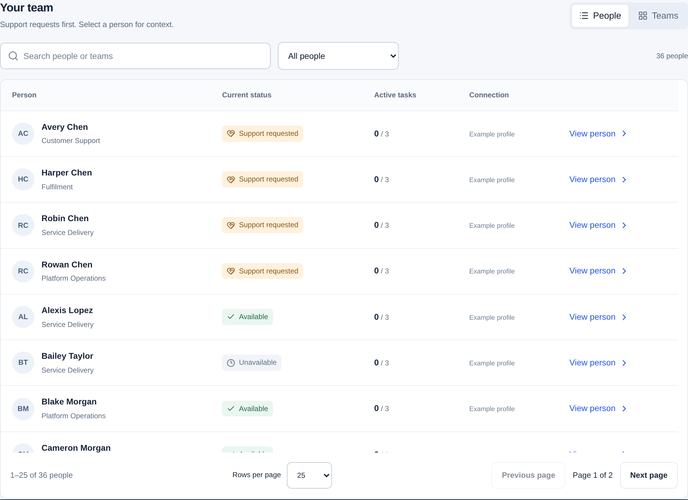
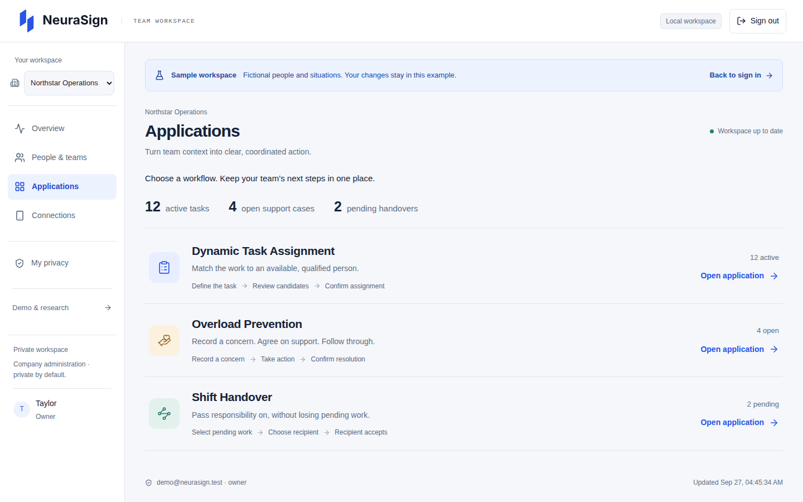
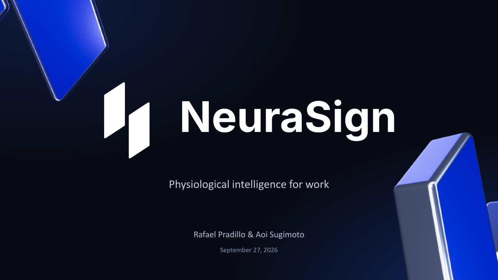

<p align="center">
  
</p>

<p align="center">
  <strong>Wearable connectivity. Private team monitoring. Clear next actions.</strong>
</p>

<p align="center">
  <a href="#see-the-story"><strong>Watch the film ↗</strong></a>
  &nbsp;&nbsp;·&nbsp;&nbsp;
  <a href="#explore-the-pitch"><strong>Explore the pitch ↗</strong></a>
  &nbsp;&nbsp;·&nbsp;&nbsp;
  <a href="#try-neurasign"><strong>Try the product ↗</strong></a>
  &nbsp;&nbsp;·&nbsp;&nbsp;
  <a href="docs/PROJECT_OVERVIEW.md"><strong>Inside the project ↗</strong></a>
</p>

---

**Work changes throughout the day. So do the people doing it.** Skills, schedules and task lists provide part of the picture. NEURASIGN is built around the context that is harder to see: how a team is handling the demands of the moment.

We bring supported wearable inputs, private team monitoring and manager-confirmed workflows into one platform. Our ambition is to help demanding workplaces understand human capacity—and respond with better-informed decisions.

## See the story

**One urgent situation. Three people. A decision that matters.**

<a href="demo%20video/exports/neurasign-hospital-76s-1080p.mp4">
  <picture>
    <source media="(prefers-reduced-motion: reduce)" srcset="demo%20video/review/hospital/poster.png" />
    
  </picture>
</a>

<p align="center">
  <a href="demo%20video/exports/neurasign-hospital-76s-1080p.mp4"><strong>▶ Full film · 76 seconds · 1080p</strong></a>
  &nbsp;&nbsp;·&nbsp;&nbsp;
  <a href="demo%20video/exports/neurasign-hospital-76s-4k.mp4">4K version</a>
  &nbsp;&nbsp;·&nbsp;&nbsp;
  <a href="demo%20video/public/audio/hospital-narration.vtt">English captions</a>
</p>

The narrated film uses a hospital to illustrate the vision. Construction, industrial operations and control rooms face related coordination challenges. **The film is a fictional concept scenario:** its physiological values, state estimates and recommendation are scripted.

## The whole team. A clear next step.

Start with the team, find what needs attention, then open the person or situation that matters. Search, team filters, grouping and pagination keep larger rosters manageable. Short status labels explain the situation; explicit actions show what happens next.

[](neurasign_server_dashboard/docs/applications.md)

<p align="center"><sub>Actual application UI · fictional sample company · 36 people across 4 teams</sub></p>

**Private by design.** Companies have separate workspaces. Managers see their assigned teams. Physiological measurements require separate permission, enforced by the API.

## Three applications. One connected workspace.

**01 — Dynamic Task Assignment**<br />
Give work a clear owner. Review qualifications, confirmed availability and existing commitments, choose an eligible person, and track the assignment through completion.

**02 — Overload Prevention**<br />
Turn a reported concern into follow-through. Record a check-in, break, coverage or work adjustment, then confirm the outcome.

**03 — Shift Handover**<br />
Keep pending work moving between shifts. Select the tasks and support cases, name the next responsible person, and track their acceptance.

<details>
<summary><strong>See the applications workspace</strong></summary>



All three applications save their changes. Assignment checks, version conflicts, retries and recipient permissions are enforced on the server. [Explore the workflows →](neurasign_server_dashboard/docs/applications.md)

</details>

## From the wrist to the workspace

**Wearable → NEURASIGN Link → Company API → Team dashboard**

The phone connects supported sources and securely queues their observations. The server preserves signal identity, units and timestamps while applying company and employee permissions. The dashboard turns permitted information into a shared working view.

A common data contract supports multiple acquisition routes: standard Bluetooth, experimental vendor streams, watch companions and authorized imports. Available signals depend on the device and integration. [Explore wearable routes and coverage →](neurasign_phone_app/docs/model-coverage.md)

## Explore the pitch

**The problem, the product vision, the architecture and the business opportunity.**

[](presentation/NeuraSign_Pitch.pdf)

<p align="center">
  <a href="presentation/NeuraSign_Pitch.pdf"><strong>Read the 18-slide deck · PDF ↗</strong></a>
  &nbsp;&nbsp;·&nbsp;&nbsp;
  <a href="presentation/NeuraSign_Pitch.pptx"><strong>Download the PowerPoint ↗</strong></a>
</p>

## Try NEURASIGN

With Docker and Docker Compose **2.24+**, run from the repository root:

```sh
docker compose up --build -d
```

Open **[localhost:3000/demo](http://localhost:3000/demo)** to enter the sample company. Assign a task, record support, and accept a handover. Your changes persist within the example.

**No wearable, research dataset, cloud account or provider key is needed for this demo.**

For company sign-in, open **[localhost:3000](http://localhost:3000)** and choose **Sign in with test account**. The public local emulator credentials are `demo@neurasign.test` / `Neurasign2026!`.

<details>
<summary><strong>More ways to explore: film player, signals and trained models</strong></summary>

| Experience | Open | What it contains |
| --- | --- | --- |
| Company workspace | [localhost:3000](http://localhost:3000) | Teams, employees, applications and phone enrollment |
| Signal explorer | [localhost:3000/signals](http://localhost:3000/signals) | Labeled synthetic signals or imported UNIVERSE recordings; optional Jev/Gemini incident example |
| Research models | [localhost:3000/models](http://localhost:3000/models) | Saved model execution on anonymous research records; preparation required |
| Emulator tools | [localhost:4000](http://localhost:4000) | Local Firebase Auth and Firestore |

To watch the film with chapter navigation, captions and a 1080p/4K selector:

```sh
python3 "demo video/scripts/preview-server.py"
```

Open **[localhost:3101](http://localhost:3101)**. The player works without Docker or an API key.

Research datasets and fitted binaries stay outside Git. On a prepared research workspace, `make models-prepare` exports the existing verified artifacts and creates a server-only proxy token. The command does not download or train models. The company demo runs without this bundle. [Model setup →](neurasign_server_dashboard/docs/model-engine.md)

</details>

## Built to be inspected

This is a **working hackathon MVP with a research foundation**. The latest recorded verification includes **169 backend tests**, **38 frontend tests**, all three persisted workflows with **80 local employee profiles**, and a **200-profile browser fixture** for layout and navigation. [Read the verification record →](neurasign_server_dashboard/docs/verification.md)

**Working today:** company/team access, protected ingestion, operational monitoring, phone gateway implementations and the three manager-confirmed applications.

**Under development:** reliable physiology-driven interpretation of live employee stress, workload, fatigue and readiness. Current applications use confirmed operational context; sample-company state indicators are illustrative. Research models run separately on dataset-specific records. Physical wearable acceptance, workplace validation and Google Cloud deployment remain outstanding.

<details>
<summary><strong>Research, AI and implementation details</strong></summary>

We have trained and evaluated models for all four targets with participants separated between training and evaluation. The targets use different inputs, reference labels and time scales. [Results and interpretation →](docs/PROJECT_OVERVIEW.md#research-results) · [Full model card →](neurasign%20engine/MODEL_CARD.md)

Jev and Gemini support the separate local incident example when configured, with visible fallback labels and human review. They do not currently provide validated live employee states. [AI boundaries →](docs/PROJECT_OVERVIEW.md#what-jev-and-gemini-do)

The larger browser fixture tests presentation; the API retains documented pilot limits. Automated task checks and visual inspection do not establish first-time human usability or production capacity. Measurement access controls do not establish legal certification. [Access contract →](neurasign_server_dashboard/docs/applications-contract.md)

| Inside the repository | Start here |
| --- | --- |
| Server, dashboard and deployment | [Server guide](neurasign_server_dashboard/README.md) |
| Phone gateway and wearable routes | [NEURASIGN Link](neurasign_phone_app/README.md) |
| Training, evaluation and model evidence | [Research engine](neurasign%20engine/README.md) |
| Editable animation, narration and exports | [Film project](demo%20video/README.md) |
| Product, architecture and current boundaries | [Project overview](docs/PROJECT_OVERVIEW.md) |
| Source-level contributor orientation | [AGENTS.md](AGENTS.md) |

Environment files, provider credentials, raw datasets and intermediate artifacts remain excluded from Git. Public emulator credentials are local-only. The presentation and supplied brand originals are preserved.

</details>

---

<p align="center">
  <strong>NEURASIGN</strong><br />
  Physiological intelligence for work.<br /><br />
  Built by Rafael Pradillo &amp; Aoi Sugimoto
</p>
