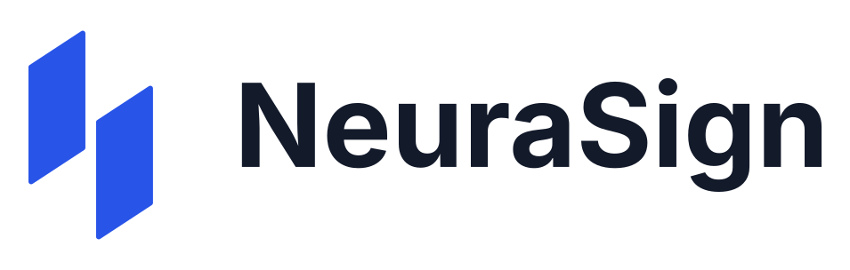
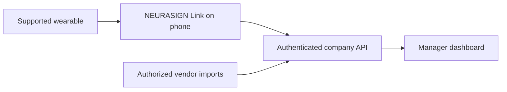

<div align="center">
  
  <h1>Understand your team. Respond with confidence.</h1>
  <p>Wearable signals, connected to a clearer picture of the team.</p>
</div>

NEURASIGN is a team-monitoring platform for demanding workplaces. It brings physiological measurements from supported wearables into one manager workspace, with the people, teams, signal history and connection status needed to understand the situation quickly.

The product is designed around a simple division: **the phone connects the wearable; the server processes and governs the data; the dashboard gives managers context.** Hospitals are one example. Construction sites, industrial operations and control rooms illustrate the wider vision.

**[Watch the 76-second film](<demo video/exports/neurasign-hospital-76s-1080p.mp4>) · [4K download](<demo video/exports/neurasign-hospital-76s-4k.mp4>) · [Pitch deck](presentation/NeuraSign_Pitch.pdf) · [Project overview](docs/PROJECT_OVERVIEW.md)**

## What we built

| Component | What is implemented | Explore |
| --- | --- | --- |
| **Company workspace** | Company accounts, teams, scoped manager access, independent employee profiles, phone enrollment, searchable lists, filters, charts and connection attention. | [Server and dashboard](neurasign_server_dashboard/README.md) |
| **NEURASIGN Link** | Native phone gateway: scan a company QR, connect supported measurement sources, preserve their values and timestamps, queue data securely, and upload it under an employee-scoped credential. | [Phone gateway](neurasign_phone_app/README.md) |
| **Wearable abstraction** | A shared observation contract for standard BLE, experimental Polar streams, watch companions and vendor import routes. Available channels are discovered and recorded with provenance. | [Coverage and route status](neurasign_phone_app/docs/model-coverage.md) |
| **Model research and execution** | Reproducible experiments for stress, readiness, fatigue and workload, plus a local workspace that executes selected fitted models on anonymous research records. | [Model evidence](<neurasign engine/MODEL_CARD.md>) |
| **Interactive demonstration** | Signal exploration, a manager preview and guided use cases. The incident example connects Jev/Gemini outputs to explicit human review steps. | [Demo walkthrough](docs/PROJECT_OVERVIEW.md#try-the-project) |
| **Presentation assets** | Original narrated animation, editable vector scenes, final 1080p/4K exports, pitch deck and cobalt brand assets. | [Film project](<demo video/README.md>) |



The company is the tenant. Teams define manager access; each enrolled phone is bound to one company and employee. The phone is a gateway, with connection and sharing controls; team analytics belong in the dashboard. [Read the onboarding and access contract.](neurasign_server_dashboard/docs/phone-onboarding.md)

## Try it in minutes

**Just watch the story:** open the [included MP4](<demo video/exports/neurasign-hospital-76s-1080p.mp4>), or serve the film player with Python 3:

```sh
python3 "demo video/scripts/preview-server.py"
```

Open **http://localhost:3101**. This needs no wearable, dataset, cloud account or API key.

**Explore the application:** with Docker and Docker Compose **2.24+** installed, run from the repository root:

```sh
docker compose up --build -d
```

| Open | What you can inspect |
| --- | --- |
| **http://localhost:3000** | Company workspace. Select **Sign in with test account**, or use `demo@neurasign.test` / `Neurasign2026!` in the local emulators. |
| **http://localhost:3000/demo** | Interactive monitoring demo. A clean checkout uses the included, labeled synthetic fixture; locally imported UNIVERSE recordings replace it when available. |
| **http://localhost:3000/models** | Model execution workspace. Predictions require the separately prepared research bundle described below. |
| **http://localhost:4000** | Local Firebase Auth and Firestore tools. |

Company workspaces begin without physiological readings. Enroll a phone or use the documented, explicitly labeled recording-upload path to exercise ingestion. The film's patient, doctors, scores and recommendation are a scripted scenario; they are not a recording of the company application.

The model datasets and fitted binaries are not in Git. On a prepared research workspace, run `make models-prepare` before starting the stack to export the bundle and create its server-only proxy token. Without preparation, the model workspace is unavailable; the company app and interactive demo still run. [Setup details](neurasign_server_dashboard/README.md) · [Research bundle preparation](neurasign_server_dashboard/docs/model-engine.md).

## The AI, in plain English

There are three distinct parts:

- **Physiological research models:** trained estimators evaluated against specific dataset references. The local `/models` workspace runs actual saved models and displays predictions beside those references.
- **Jev and Gemini:** optional providers for the local incident example. Jev selects among eligible candidates; Gemini analyzes sample incident evidence and drafts artifacts. Results identify provider or fallback execution, and human review remains explicit.
- **Company monitoring:** authenticated ingestion and presentation of received measurements. The research models are not silently applied to employees, and demo formula indices are labeled as estimates.

Selected research results include **94.2% accuracy** for WESAD laboratory condition classification and **3.98-point mean absolute error out of 100** for daily Oura readiness approximation. The first uses three held-out people; the second uses four. Fatigue and workload have weaker or confounded evidence. These are different tasks and time scales, not one accuracy score for live employee monitoring. The [four-target results table](docs/PROJECT_OVERVIEW.md#research-results) includes all four targets, baselines and interpretation; the [model card](<neurasign engine/MODEL_CARD.md>) preserves the complete evidence.

## Current delivery status

The local application, gateway implementations, interactive demo, research pipeline and film are present in this repository. UI verification includes a 200-profile/eight-team fixture; the current API retains explicit pilot bounds. That UI fixture is not a backend capacity benchmark. [Verification record](neurasign_server_dashboard/docs/verification.md) · [Pilot limits](neurasign_server_dashboard/docs/phone-onboarding.md).

The remaining deployment work is concrete: validate physical devices and vendor accounts, complete the outstanding native platform checks, deploy to the designated Google Cloud account, and verify operational capacity and interpretation quality for the intended workplace. **No physical wearable has been validated, and no Google Cloud deployment has been completed.** [Deployment preparation](neurasign_server_dashboard/docs/gcloud-deployment.md) uses an explicit target account/project; it does not use the terminal's active account implicitly.

## Repository map

| Path | Purpose |
| --- | --- |
| [`neurasign_server_dashboard/`](neurasign_server_dashboard/README.md) | Company API, web app, local demo, model service, deployment and tests. |
| [`neurasign_phone_app/`](neurasign_phone_app/README.md) | Phone gateway, measurement contracts, BLE decoders and watch companions. |
| [`neurasign engine/`](<neurasign engine/README.md>) | Dataset preparation, training, evaluation, reports and artifact fingerprints. |
| [`demo video/`](<demo video/README.md>) | Editable animation, narration, music, player and final films. |
| [`presentation/`](presentation/NeuraSign_Pitch.pdf) | Final PDF and editable PowerPoint deck. |
| [`NeuraSign_Cobalto_logos/`](NeuraSign_Cobalto_logos/LEEME.md) | Supplied logo variants and brand tokens. |
| [`docs/PROJECT_OVERVIEW.md`](docs/PROJECT_OVERVIEW.md) | Product brief, walkthrough, implementation status and evidence map. |

For source-level orientation, see [AGENTS.md](AGENTS.md). For local development and the applicable checks, use the [server](neurasign_server_dashboard/README.md), [native app](neurasign_phone_app/mobile/README.md) and [engine](<neurasign engine/README.md>) guides. The [repository timeline](docs/repository-timeline.md) records the original import history.

Environment files, credentials, raw research recordings and intermediate artifacts remain excluded from Git. Reviewed final film exports and narration assets are explicitly included. `.env.example` contains public configuration examples and empty credential fields.
