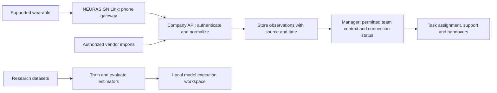

# NEURASIGN: project overview

**Wearables capture signals. NEURASIGN makes them usable across a team.**

NEURASIGN brings supported wearable measurements into a shared monitoring workspace for demanding workplaces. A manager can find a person or team, review operational context and open situations, assign work, coordinate support and transfer responsibility. Owner/manager permissions protect physiological values at the API. The longer-term interpretation layer aims to help explain stress, fatigue, workload and readiness with evidence appropriate to each target.

The hospital in the [76-second film](<../demo video/exports/neurasign-hospital-76s-1080p.mp4>) is an example, not the product's entire market. Construction, industrial operations and control rooms illustrate the same need: understand the team when the consequences of missing context are high. The film's clinical scenario and recommendation are scripted; the application is not a deployed clinical decision system.

## How the product fits together

The phone handles connection, permissions, source discovery, temporary storage and upload. It is **not an employee analytics platform**. The server owns identity, tenant boundaries, observation validation, storage and access. The dashboard organizes that information for managers.

A shared observation contract preserves the metric, unit, measurement time, quality and source. Different acquisition routes can supply that contract without changing the dashboard for every brand. This abstraction does not unlock measurements a manufacturer does not expose: standard Bluetooth, vendor streams, watch companions and cloud imports have different available signals and delays. See the [metric contract](../neurasign_server_dashboard/docs/telemetry.md) and [wearable coverage matrix](../neurasign_phone_app/docs/model-coverage.md).

The company is the tenant. Dashboard accounts and measured employee profiles are separate. Owners assign managers to teams; phone enrollment binds a credential to one company and one employee. Server checks enforce those scopes, including the team at measurement time. The [onboarding contract](../neurasign_server_dashboard/docs/phone-onboarding.md) explains enrollment, consent, revocation and delayed uploads.

## What is implemented

| Area | Concrete implementation | Evidence |
| --- | --- | --- |
| Company access | Firebase authentication, company membership, owner/manager/employee roles, scoped teams and independent employee profiles. | [Workspace](../neurasign_server_dashboard/docs/company-workspace.md), [onboarding](../neurasign_server_dashboard/docs/phone-onboarding.md) |
| Team monitoring | Prioritized situations, search, team/status filters, grouping, pagination and person details; server-enforced physiological redaction. | [Interface design](../neurasign_server_dashboard/docs/interface-design.md) |
| Operational applications | Dynamic Task Assignment, Overload Prevention and Shift Handover, with real saved workflows and explicit human decisions. | [Applications](../neurasign_server_dashboard/docs/applications.md), [API contract](../neurasign_server_dashboard/docs/applications-contract.md) |
| Phone gateway | Native React Native/Expo app, QR enrollment, BLE connections, secure credentials, encrypted upload queue and sharing controls. A native build is required; Expo Go is insufficient. | [Native app](../neurasign_phone_app/mobile/README.md) |
| Multiple signal sources | Standard BLE decoders, experimental Polar streaming, watch companion adapters, platform health import and vendor integration routes. | [Route-by-route status](../neurasign_phone_app/docs/model-coverage.md), [vendor integrations](../neurasign_phone_app/docs/vendor-integrations.md) |
| Research | Dataset preparation, participant-separated evaluation, baseline comparisons, saved estimators and experiment reports for all four targets. | [Model card](<../neurasign engine/MODEL_CARD.md>) |
| Model execution | Four research cards execute pinned fitted artifacts on anonymous evaluation records, showing prediction, reference and provenance. | [Model engine](../neurasign_server_dashboard/docs/model-engine.md) |
| Guided demonstration | 36 fictional profiles in the same company UI; independent source-labeled Signal explorer and optional Jev/Gemini incident example. | [Applications walkthrough](../neurasign_server_dashboard/docs/applications.md) |
| Delivery assets | Docker setup, Google Cloud deployment preparation, pitch deck, brand assets and an editable narrated 1080p/4K film. | [Deployment](../neurasign_server_dashboard/docs/gcloud-deployment.md), [film source](<../demo video/README.md>) |

## Try the project

1. **Start with the story.** Watch the included film or run `python3 "demo video/scripts/preview-server.py"` from the repository root and open **http://localhost:3101**. No dependency install, dataset or API key is needed for playback.
2. **Open the application.** With Docker and Docker Compose **2.24+**, run `docker compose up --build -d` from the root. Open **http://localhost:3000** and choose **Sign in with test account**. The public local-only emulator credentials are `demo@neurasign.test` / `Neurasign2026!`. No Google Cloud account is needed.
3. **Explore the company workspace.** Review Overview, People & teams, Applications and Connections. Create a team and employee, then use **Connect phone** to inspect enrollment. An actual phone claim needs the native gateway and appropriate network access. Empty measurement views are expected until a source uploads observations. [Native setup](../neurasign_phone_app/mobile/README.md) includes local Android networking requirements.
4. **Explore the complete product demo.** Open **http://localhost:3000/demo**. It signs into the public local emulator account and opens Northstar Operations: 36 fictional employees, four teams and the same company UI. Select an attention item, confirm a task assignment, record support and accept a handover. Changes persist within the isolated example. **Back to sign in** exits the demo. The separate **http://localhost:3000/signals** retains recorded/synthetic physiological exploration and the AI incident example. [Step-by-step walkthrough](../neurasign_server_dashboard/docs/applications.md).
5. **Inspect real model execution on a prepared research workspace.** After obtaining and preparing the documented datasets and fitted artifacts, run `make models-prepare`, start the stack, and open **http://localhost:3000/models**. Choose a model and **Run recorded example**. The preparation command requires existing research artifacts; it is not a dataset downloader. These ignored artifacts and a generated server-only proxy token are absent from a clean clone, so model execution is unavailable until preparation succeeds. [Full model setup](../neurasign_server_dashboard/docs/model-engine.md).

The film player and interactive fixture run without provider keys. The incident example makes real Jev/Gemini calls when configured, and explicitly labels deterministic/local fallbacks otherwise. Existing saved model inference does not require either provider. Company ingestion, the demo, the research workspace and the film have separate inputs and responsibilities.

## Research results

Training uses conventional supervised machine learning: extract or aggregate the dataset's available physiological features, train candidate estimators, compare against simple references, and evaluate with people separated between training and evaluation. Different labels require different windows. A daily questionnaire, a vendor's daily readiness score and a completed-task workload rating cannot establish second-by-second ground truth.

These are the **selected models exposed in the research workspace**, not a claim that every experiment succeeded:

| Target and method | Evaluation result | Evaluation scope | Interpretation and comparison |
| --- | --- | --- | --- |
| **Stress condition** — 300-tree ExtraTrees classifier | **94.2% accuracy; 92.2% balanced accuracy** | WESAD: 86 synchronized 60-second wrist windows from 3 held-out people. | Strong separation of laboratory baseline versus TSST conditions on this split. The predeclared logistic reference scored **96.5% / 95.7% balanced**, higher than the selected model. This does not establish live workplace stress accuracy. |
| **Daily readiness** — ensemble of SVR and two CatBoost regressors | **3.98 points MAE / 100; 93.4% within ±10 points** | Oura reference scores: 684 days from 4 held-out people. | Approximates the vendor's daily score using completed sleep and preceding activity/physiology. Constant baseline: **8.71 points MAE**. It is not an instantaneous fitness-for-work measure. |
| **Daily fatigue** — cardiac ExtraTrees classifier | **60.6% balanced accuracy; 54.8% person-weighted accuracy** | DailySense: 96 daily records from 8 held-out people; daily fatigue questionnaire threshold ≥50/100. | Weak evidence: high-fatigue recall **43.0%**; balanced-accuracy interval **46.1–72.0%**. Always predicting high fatigue gives **50% balanced / 66.6% person-weighted accuracy**. Not a reliable general detector. |
| **Completed-task workload** — nested model selection across 28 registered candidates | **13.02 points MAE / 100** | UNIVERSE: 167 completed tasks from 19 previously studied development participants, using four participant-separated outer folds. | Predicts overall weighted NASA-TLX task ratings using each record's matching fold model. Fixed Ridge reference: **16.04 points MAE**; post-hoc context-only comparator: **13.22**. The extra value of physiology is not established by this comparison. |

**Accuracy** is the percentage of correct classifications. **Balanced accuracy** averages the recall for each class, so a common class cannot dominate the score. **MAE** is the average absolute score error: 3.98 means predictions were about four points away on average, not “96.02% accuracy.” “Within ±10” is a tolerance measure, not a confidence probability for an individual prediction. Readiness, fatigue and workload summaries give each person equal weight; the cohorts and observation periods differ, so these numbers are not directly interchangeable.

The [model card](<../neurasign engine/MODEL_CARD.md>) and experiment reports [016](<../neurasign engine/experiments/016-readiness-oura-results.md>), [018](<../neurasign engine/experiments/018-dailysense-results.md>), [021](<../neurasign engine/experiments/021-workload-improvement-results.md>) and [022](<../neurasign engine/experiments/022-wesad-stress-results.md>) contain the selection procedures, baselines, uncertainty and limitations. Dataset-specific access and usage conditions remain applicable; raw recordings and fitted binaries are not distributed in Git.

The model service preserves all **1,033** original evaluation records and their associated artifacts, including workload fold membership. It checks artifact hashes and accepts anonymous record IDs, not employee identities or arbitrary feature uploads. The research workspace is local-only and disabled in production. Running a saved model reproduces computation; it does not add new validation.

## What Jev and Gemini do

In the local incident example, deterministic rules first determine eligible candidates. **Jev** makes a typed choice among those candidates using allowlisted work context. Its response cannot override eligibility. **Gemini** analyzes sample incident evidence and drafts workflow artifacts. The user must confirm the diagnosis and approve the recovery plan; Gemini has no production rollback or deployment tools.

Neither provider turns received company biometrics into validated employee states. The `/signals` indices use labeled illustrative formulas; the `/demo` company has clearly scripted state indicators; `/models` runs separately trained research artifacts. The animated film uses scripted values. Provider provenance and fallback status are visible in the interactive example. See [demo architecture and provider boundaries](../neurasign_server_dashboard/docs/architecture.md).

## Current boundaries and next milestones

The project combines a functioning local company workflow, gateway implementations, research execution and presentation assets. The outstanding work is specific:

- **Hardware and vendor acceptance:** validate physical wearables, native platform behavior and real vendor accounts. Implemented decoders and simulated/native checks do not establish compatibility with every marketed device. No physical wearable has been validated yet.
- **Production deployment:** use the designated Google Cloud account/project, configure the documented services and complete operational checks. Deployment preparation exists; no Google Cloud deployment has been completed.
- **Scale:** UI checks include 200 profiles across eight teams. The API still has a 100-independent-employee/50-team pilot creation bound and returns authorized snapshots; hundreds of active devices need backend capacity work and load verification.
- **Access policy:** implemented company/team checks now redact physiological measurements for owners/managers and deny direct raw-history access. Legacy self-access and an explicit scoped measurement capability remain separate. The Signal explorer's **Manager preview** is still a research presentation example. These controls are not a certification of regulatory compliance. See [access scope](../neurasign_server_dashboard/docs/manager-preview.md).
- **Live interpretation:** establish the necessary inputs and workplace-relevant references before connecting research predictions to employee monitoring. Current daily and completed-task models cannot consume an arbitrary second of live wrist data.

The [verification record](../neurasign_server_dashboard/docs/verification.md) distinguishes automated tests, emulator-backed workflows, intercepted browser fixtures and unverified hardware. Its dated entries describe checks performed for those revisions, not a new test run every time the documentation changes.

## Where to inspect the implementation

| Question | Starting point |
| --- | --- |
| How are companies, teams and employees isolated? | [Company access checks](../neurasign_server_dashboard/services/api/neurasign/company_access.py), [phone enrollment](../neurasign_server_dashboard/services/api/neurasign/onboarding.py) |
| How do measurements arrive? | [Gateway package](../neurasign_phone_app/README.md), [canonical telemetry](../neurasign_server_dashboard/docs/telemetry.md) |
| What does the manager actually see? | [Company workspace UI](../neurasign_server_dashboard/apps/web/components/company-workspace.tsx), [operational overview](../neurasign_server_dashboard/apps/web/components/company-command-center.tsx) |
| Where do demo values and decisions come from? | [Signal sources](../neurasign_server_dashboard/services/api/neurasign/signals.py), [inference](../neurasign_server_dashboard/services/api/neurasign/inference.py), [routing](../neurasign_server_dashboard/services/api/neurasign/routing.py) |
| Are saved models really executed? | [Model runtime](../neurasign_server_dashboard/services/models/runtime.py), [inference implementation](../neurasign_server_dashboard/services/models/inference.py), [research reports](<../neurasign engine/experiments>) |
| How was the film made? | [Editable video project](<../demo video/README.md>) |

For development commands and repository conventions, start with [AGENTS.md](../AGENTS.md) and the relevant component README.
