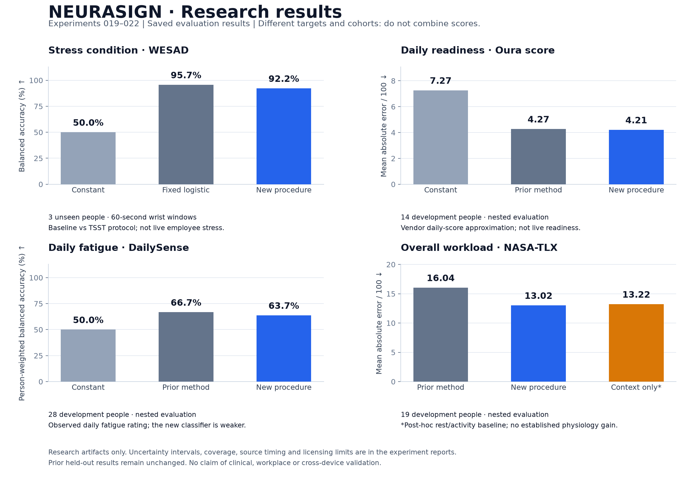

# NEURASIGN model evidence

NEURASIGN has trained research models and reproducible evaluation code. It does **not** have an independently validated model with 80% accuracy across stress, readiness, fatigue and workload. The company application does not load these research artifacts; the demo's workload, fatigue and readiness indices still use explicit experimental formulas.

## The four research targets

| Target | Available evidence | Current status |
| --- | --- | --- |
| Stress | Self-reported stress in UNIVERSE/SWELL, plus separate WESAD baseline-versus-TSST condition labels | New wrist condition classifier: 94.2% accuracy / 92.2% balanced on three unseen people; not general live stress validation |
| Workload | Separate questionnaire dimensions and an anonymous research benchmark for overall weighted NASA-TLX | A context-only baseline nearly matches the new overall model; reliable physiological discrimination remains unproven |
| Fatigue | Observed fatigue questionnaires in MEFAR, FatigueSet, the Luo daily wearable study and DailySense | New trained models; no reliable general fatigue detector established |
| Readiness | Oura's vendor-generated daily readiness score in IFH Affect | Daily score approximation: 3.98-point MAE; this does not validate live employee readiness |

A common feature pipeline or shared neural encoder cannot create missing target answers. Each target needs its own reference definition and evaluation. These outputs cannot share one claimed accuracy number.

## Improvement round: experiments 019–022

This round compares richer physiological histories, robust signal summaries, weighted preprocessing, nonlinear regressors, classifiers and ensembles. Experiments 019–021 use **nested participant-disjoint development evaluation**: models and thresholds are chosen in inner folds, then scored on different people in outer folds. Previously scored test participants stay excluded. These are paired comparisons on the same new folds, not direct improvements over older held-out scores from other people. Experiment 022 separately reserves previously unused WESAD participants.



The round passed 134 implementation tests, artifact replay checks and independent arithmetic/selection audits. [Fingerprints](experiments/improvement-round-artifacts.json) identify 33 saved artifact files, including constant references; fitted weights and participant-level evidence stay ignored. The figure can be regenerated with `scripts/plot_improvement_results.py` and the inventory with `scripts/report_improvement_artifacts.py` after verification.

### Wrist stress-condition recognition: a strong new laboratory result

[Experiment 022](experiments/022-wesad-stress-results.md) adds a new external dataset, WESAD. It uses only synchronized Empatica E4 wrist pulse, EDA, temperature and acceleration, without chest or EEG. Twelve development people and four participant-disjoint folds select among 32 configurations. The chosen ExtraTrees model is then evaluated once on **three untouched people, with 86 non-overlapping 60-second windows**.

| Prespecified arm | Accuracy | Balanced accuracy | Baseline recall | TSST recall |
| --- | ---: | ---: | ---: | ---: |
| Always baseline | 66.3% | 50.0% | 100.0% | 0.0% |
| Fixed logistic reference | 96.5% | 95.7% | 98.2% | 93.1% |
| Development-selected ExtraTrees | **94.2%** | **92.2%** | **98.2%** | **86.2%** |

The selected procedure did **not** beat the fixed logistic reference on these test people; the reference is not retroactively substituted as the selected winner. Mean per-person balanced accuracy for the selected model is 92.7%, with a descriptive person-bootstrap interval of 83.7–100%; three people cannot establish population reliability.

This is **baseline-versus-TSST laboratory condition recognition**, not a prediction of actual instantaneous self-reported stress. Transitions and other protocol conditions are excluded; speech, posture, activity and temperature drift may contribute to separation. The result cannot be presented as an increase from the SWELL self-report score because the target and cohort differ. It does not establish transfer to other wearables, one-second inference or employee monitoring. The source permits scientific non-commercial use; these artifacts remain research-only and production-disabled.

### Readiness: a small improvement, below the research gate

[Experiment 019](experiments/019-readiness-refinement-results.md) compares 18 configurations using the original 50 features or 261 features with richer sleep, activity and strictly preceding physiological context. Across 14 development people and 2,788 days, MAE decreases from **4.274 to 4.207/100** against the refitted prior ensemble: a **1.6%** reduction. R² is 0.650 and agreement within ±10 points is 93.3%. This falls short of the predeclared ≥10% improvement and ≤4-point error gate. The earlier **3.98-point held-out MAE** remains a separate result; these different cohorts cannot be used to claim deterioration or improvement of that number.

The selected-minus-prior MAE difference has a 95% person-bootstrap interval of **−0.336 to +0.208 points**; the small apparent gain is inconclusive.

An independent source audit found nine raw sleep records with reversed endpoints, two of which enter this scored cohort. No timestamps were guessed or repaired after scoring; their raw overnight trajectories are missing. Excluding the two affected predictions leaves MAE 4.207 versus 4.271, essentially unchanged. Earlier anomalous records can also enter physiological histories, so this is a descriptive sensitivity, not a fully repaired causal-data experiment. All inner selections and outer-training constants were independently recomputed.

### Fatigue: new search does not beat the fixed classifier

[Experiment 020](experiments/020-fatigue-nested-results.md) evaluates 36 configurations across classification and regression, with past physiology deviations and compact intact-channel features. All 357 fatigue answers from 28 development people remain eligible; no middle ratings are discarded. The fixed prior ExtraTrees obtains **66.7% balanced accuracy**, versus **63.7%** for the newly selected procedure and 50% for a constant. This is not a measured improvement from the earlier 60.6% test result: the cohorts differ. The new regression reduces MAE from 18.86 to 18.50/100, but the paired uncertainty interval includes no improvement and R² remains negative. Both research gates fail.

### Overall workload: much of the apparent gain comes from task context

[Experiment 021](experiments/021-workload-improvement-results.md) predicts the actual weighted NASA-TLX total, verified against its six component ratings and 15 pairwise weights. This is a different target from the mental-demand component previously reported. In 19 development people and 167 completed tasks, the new procedure lowers MAE from **16.04 to 13.02/100**. However, reference-feature availability perfectly separates initial relaxation from active tasks. A separate **post-hoc context-only baseline**, using no physiology, reaches **13.22**. The model's 0.20-point gain over that diagnostic has a paired 95% interval of −0.66 to +1.01; physiological benefit is not established.

During active tasks alone, the model has MAE 12.97 and R² 0.077. Its 82.7% balanced accuracy on the prespecified extreme low/high subset falls to **49.5%** when relaxation is excluded; the extreme subset also omits roughly half the task labels. The 82.7% figure must not be presented as general workload accuracy. These estimates require complete tasks and do not validate one-second or live workload. The composite remains outside the workplace product path.

## Earlier reserved-person fatigue and readiness evaluations

These experiments acquire actual reference labels and reserve entire people before model selection. All preprocessing and model selection use development people only. A saved, frozen selection precedes each final test. Reported accuracies give people equal weight; the reports also preserve raw confusion counts. The models remain separate from the application and its demo formulas.

| Experiment | Reference / time scale | Reserved evaluation | Main result | Interpretation |
| --- | --- | --- | --- | --- |
| [014: MEFAR](experiments/014-mefar-results.md) | Chalder Fatigue Scale, two sessions per person | 5 people | 51.1% ordinary / 46.7% balanced accuracy | Below the 50% balanced constant baseline |
| [015: FatigueSet physical](experiments/015-fatigueset-results.md) | Physical fatigue VAS ≥50; 60-second wrist evidence | 3 people, 27 answers | 66.7% ordinary / 82.7% balanced accuracy | Only **one** high-fatigue answer and nine false alarms; insufficient evidence |
| [015: FatigueSet mental](experiments/015-fatigueset-results.md) | Mental fatigue VAS ≥50; 180-second wrist evidence | 3 people, 27 answers | 77.8% ordinary / 43.8% balanced accuracy | Detects none of the three high-fatigue answers |
| [016: Oura readiness](experiments/016-readiness-oura-results.md) | Vendor daily score, 1–100 | 4 people, 684 days | **3.98-point MAE**, versus 8.71 for the constant | Useful daily vendor-score approximation; not instantaneous readiness validation |
| [017: daily fatigue](experiments/017-fatigue-daily-results.md) | Overall fatigue VAS, 1–10; previous-day upper-arm wearable signals | 6 people, 117 days | 2.309-point MAE, versus 2.318 for the constant | Less than 1% improvement; physical/mental exhaustion frequency also fails to improve consistently |
| [018: DailySense fatigue](experiments/018-dailysense-results.md) | Observed daily fatigue VAS ≥50 | 8 people, 96 days | 54.8% person-weighted / 60.6% balanced accuracy | High-fatigue recall 43.0%; within-person balanced accuracy 53.2% |

Readiness reaches **71.7% agreement within ±5 points** and **93.4% within ±10 points** of Oura, with R² = 0.770. These are tolerance agreements, not classification accuracies. The selected ensemble combines SVR and two CatBoost models using completed sleep physiology, sleep summaries, prior activity and past physiological history. It excludes every vendor score, readiness contributor, target history and questionnaire input. Its 95% person-bootstrap MAE interval is 3.11–5.11 points. The original data do not provide the exact publication timestamp of each Oura score; the comparison is offline and daily.

The fatigue experiments compare linear models, RBF support-vector models, ExtraTrees and CatBoost across signal profiles, window lengths or past physiological baselines. The high FatigueSet physical balanced accuracy must not be presented as “82.7% validated fatigue detection”: its positive-class result rests on one answer, and its low-class recall is only 65.4%. None of these fatigue experiments meets its predefined research gate. Combining differently defined questionnaires as if they were the same label would not resolve that limitation.

DailySense adds 453 original fatigue ratings from 36 people. Its selected ExtraTrees classifier uses daily cardiac summaries. The test includes 70 high and 26 low answers, so the weak result cannot be dismissed as a single-positive evaluation. Its person-bootstrap balanced-accuracy interval is 46.1–72.0%. The separate intensity regressor has MAE 20.89/100 versus 20.14 for a constant. Damaged source channels are excluded individually after full-archive publisher checksums; this and daily label timing limit interpretation. The [report](experiments/018-dailysense-results.md) records all exclusions and metrics.

Across experiments 014–018, 468 profile/algorithm configurations were compared, plus development-only ensembles and the declared MEFAR thresholds. Nineteen fitted artifact files are retained locally; their [published fingerprints](experiments/fatigue-readiness-artifacts.json) identify the actual saved models and evaluation records. This inventory does not convert weak evaluation results into validated product outputs.

## Stress: measured SWELL result

[Experiment 013](experiments/013-swell-stress-results.md) trains on the workbook's actual `Stress` responses. It compares low (≤3⅓) and high (≥6⅔) exported ratings; middle ratings are excluded. Inputs are HR, RMSSD and SCL. They were measured with chest ECG and finger conductance, so this is **not validation on consumer wrist devices**.

The fixed model is a logistic classifier with C=1, specified before observing the new results. Imputation and scaling are fitted inside training folds. Five outer folds hold out whole people; an additional selected-model arm chooses among four algorithms using three inner person-disjoint folds. All evaluated minutes are out of fold.

| Prespecified arm | Person/block-weighted accuracy | Balanced accuracy | High-stress recall |
| --- | ---: | ---: | ---: |
| Always the outer-training majority | 88.2% | 50.0% | 0.0% |
| Fixed logistic model | **79.5%** | **75.5%** | **70.2%** |
| Model selected inside training folds | 73.8% | 50.6% | 20.2% |

The fixed model's result is a measured, exploratory benchmark result. It must not be rounded into “NEURASIGN detects employee states with 80% accuracy.” The selected procedure's much weaker result is also reported; no winner is retroactively substituted for that procedure.

The evaluated subset contains 17 development people, 41 blocks and 1,235 minute rows, from 1,766 development minutes with physiology. It excludes 531 middle-rated minutes. Only **four blocks from three people** have high stress; only two people have both low and high blocks. Their fixed-model within-person balanced accuracy is 45.2%, which is not evidence of reliable individual state-change detection. The minutes repeat block-level answers and are not independent labels. The original five test people remain excluded; this is development evaluation, not fresh external confirmation.

## Other stress and workload evidence

[Experiment 012](experiments/012-stress-results.md) joins original UNIVERSE stress responses to the existing wrist feature windows. Label coverage leaves only two paired people for Lab1-to-Lab2 evaluation. The selected personal model scores 59.5% within-person balanced accuracy; that sample is too small to establish generalization. The missing labels are not inferred from tasks or other questionnaires.

[Experiment 010](experiments/010-personalization-results.md) measures a separate workload component: low/high self-reported mental demand. The hybrid reaches 60.1% within-person balanced accuracy in 17 people and 54.3% when relaxation is excluded among the 13 retaining both classes. These are not stress, fatigue or readiness accuracy figures.

[Experiment 011](experiments/011-short-window-results.md) compares exactly one second of raw samples against matched sixty-second windows. The one-second mental-demand results remain near the 50% constant reference. This did not produce a faster validated interpretation model.

## Review and reproduce

The complete model definitions, preprocessing, grouping rules, target thresholds, protocols and aggregate results are versionable source files. Datasets, individual predictions, provider responses and fitted artifacts remain in ignored local directories with checksums. Credentials remain in ignored environment files.

From `neurasign engine/`:

```sh
# Verify already completed research artifacts without tuning on their outcomes.
.venv/bin/python scripts/run_stress_benchmark.py verify
.venv/bin/python scripts/run_swell_stress.py verify
.venv/bin/python scripts/run_short_window.py verify
.venv/bin/python scripts/run_mefar.py verify
.venv/bin/python scripts/run_fatigueset.py verify --target physical
.venv/bin/python scripts/run_fatigueset.py verify --target mental
.venv/bin/python scripts/run_readiness_oura.py verify
.venv/bin/python scripts/run_fatigue_daily.py verify
.venv/bin/python scripts/run_dailysense.py verify
.venv/bin/python scripts/audit_reference_benchmarks.py
.venv/bin/python scripts/run_readiness_refinement.py verify
.venv/bin/python scripts/audit_readiness_refinement.py
.venv/bin/python scripts/run_fatigue_nested.py verify
.venv/bin/python scripts/run_workload_improvement.py verify
.venv/bin/python scripts/run_wesad_stress_022.py verify

# Run the engine's implementation tests.
.venv/bin/python -m unittest discover -s tests -v
```

Each experiment report documents its reproduction commands. The independent reference audit recomputes metrics and training-only constant predictions without importing the benchmark scoring functions. Preparation requires the verified source data and prior participant splits described in the engine README. Completed runs refuse replacement. Existing test subjects are not silently recycled into training.

Artifacts explicitly carry `production_enabled=False`. Research predictions are neither diagnoses nor fitness-for-duty clearance. No trained stress output has been connected to named employees or the manager dashboard.
