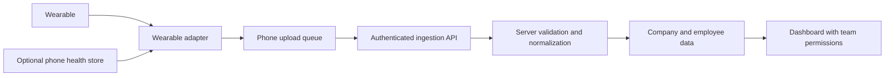

# Wearable gateway and multitenancy design

Status: September 26, 2026. Source registration, observations, normalization, dashboard rendering, employee/team permissions, QR enrollment and the native mobile shell are implemented. See the [onboarding contract](../neurasign_server_dashboard/docs/phone-onboarding.md), [native build guide](mobile/README.md) and [telemetry contract](../neurasign_server_dashboard/docs/telemetry.md). No hardware compatibility is certified.

## Product boundary

NEURASIGN gives a company a dashboard of its employees' available physiological measurements. The phone is the collection gateway. Its product surface is limited to company enrollment, wearable selection, OS permissions, connection/sync status and pause/disconnect controls. Employee analytics, reports, company administration and team management belong in the web application.

An employee record identifies the person whose measurements are collected. A dashboard user account authenticates someone allowed to view or administer company data. These are separate concepts even when one person has both.



The wearable needs to reach its phone, and the phone needs an Internet connection to deliver readings. The dashboard does not need to be near the wearable. If the phone loses connectivity, the dashboard must show the last measurement's age. Later delivery does not turn old measurements into live ones.

## Connectivity strategy

Implement independent adapters behind a shared contract. Prefer direct phone access. An optional health-store or manufacturer-cloud connector can add coverage where permitted, but is a distinct route with its own delay and dependencies. A phone cannot extract measurements that the device or platform does not expose.

The following are researched access routes, **not a list of devices supported by NEURASIGN**. Standard BLE HR/RR, thermometer and pulse oximeter decoders plus an experimental direct Polar PMD connector are implemented against the shared transport; the native transport uses react-native-ble-plx. The official Polar SDK is not bundled. The Wear OS companion and paired Android bridge are also implemented. An optional Samsung Health Sensor binding is present but its account-gated SDK is not included or runtime-tested. Other routes below are unimplemented. All routes remain untested on hardware. See the [implemented connector matrix](docs/wearable-connectivity.md).

| Route | Potential coverage | Boundary to preserve |
| --- | --- | --- |
| Standard Bluetooth LE services | Devices exposing the relevant standard service, beginning with heart rate | Bluetooth presence alone does not establish service or metric support. Discover actual characteristics and capabilities. [Bluetooth SIG Heart Rate Service](https://www.bluetooth.com/specifications/specs/heart-rate-service-1-0/) |
| Polar BLE SDK | Supported Polar sensors and watches on Android/iOS; available streams depend on the device | Register support per model and stream, then validate the target firmware and phone. [Official SDK](https://github.com/polarofficial/polar-ble-sdk) |
| Wear OS platform sensors / optional Samsung Health Sensor SDK | Paired Android watch companion forwarding available raw sensors to the phone | Matching app/signing identity, watch permissions and nearby connection required. Samsung-only channels require its SDK and device policy. See [companion guide](watch_app/README.md). |
| Garmin Health SDK | Direct mobile integration with supported Garmin wearables | Requires evaluating the applicable SDK, partner access and commercial terms; do not treat it as an unrestricted generic BLE adapter. [Garmin Health SDK](https://developer.garmin.com/health-sdk/) |
| Android Health Connect | Measurements that authorized source apps have written to the phone's health store | Read/sync access is separate from direct wearable pairing. Delivery depends on the source app and platform permissions. [Android synchronization guide](https://developer.android.com/health-and-fitness/health-connect/sync-data) |
| Apple HealthKit / watchOS | Authorized stored health samples; selected live watch use cases require watch-side integration | Reading HealthKit on the phone is not proof of continuous live watch access. Apple's high-frequency heart-rate workout flow has an actual workout-session context. [Apple workout sessions](https://developer.apple.com/documentation/healthkit/running-workout-sessions) |
| WHOOP official API, optional cloud route | Authorized recovery, sleep, cycle and workout data | These data products do not establish access to a continuous raw sensor stream. Keep summary periods and vendor metrics distinct. Investigate any direct broadcast route separately for the exact model before claiming support. [WHOOP API](https://developer.whoop.com/api/) |

Other brands join through the same process: identify a documented route, inspect its access conditions, implement an adapter and validate the exact capabilities on hardware. Do not advertise a brand-wide integration based only on an SDK name or a successful Bluetooth scan.

Maintain a capability catalog keyed by manufacturer/model, firmware, phone OS/version, adapter/version and metric. Track three distinct stages: **documented route**, **implemented connector**, **hardware validated**. Include access requirements, measurement semantics, sampling cadence, delivery latency and known background restrictions. Discover capabilities at runtime as well; permissions and device modes can change them.

## Adapter boundary

The broader lifecycle below is the native integration target. The implemented portable interface is in `src/contract.ts`; source selection/discovery, OS permissions and native lifecycle handling are provided by the native mobile shell:

```text
discover()                     -> candidate sources
connect(source, permissions)   -> connection state
capabilities()                -> metric definitions and availability
observations(cursor?)         -> measurements or historical changes
disconnect()                  -> stopped
```

A capability describes its metric, unit, method, measurement period, delivery mode (`stream` or `sync`), expected cadence, required permissions and availability. Use explicit reasons such as `unsupported`, `permission_required`, `disconnected` or `temporarily_unavailable`. Unsupported and temporarily missing data are different states.

Adapters own transport parsing and accurate metric labels, units and timestamps. The server owns unit conversion, semantic validation, persistence and analytical processing. Shared gateway code owns enrollment-bound queue access, stable IDs and batch transport. The native shell must implement encrypted persistence and upload scheduling behind those interfaces. Device-specific branches must not spread into company permissions or dashboard components.

Native Android/iOS integrations must handle lifecycle, permission changes, reconnects and background execution. A shared UI framework does not remove that work. Select platform/framework versions during implementation using the actual SDK requirements; do not promise uninterrupted collection before locked-screen, background and restart tests on real phones.

## Canonical measurements

Normalize equivalent quantities, units and timestamps. Preserve differences in meaning rather than hiding them behind a generic number.

| Canonical metric | Unit | Meaning / mapping rule |
| --- | --- | --- |
| `heart_rate` | bpm | Heart rate, with measurement interval and method retained |
| `hrv_rmssd` | ms | RMSSD; retain interval, derivation and artifact handling |
| `hrv_sdnn` | ms | SDNN; a separate metric, never silently converted to RMSSD |
| `skin_temperature` | °C | Absolute skin temperature; keep body/core temperature separate |
| `skin_temperature_delta` | °C | Difference from a source-defined baseline; not an absolute temperature |
| `electrodermal_conductance` | µS | Conductance; not a vendor stress or recovery score |
| `acceleration_magnitude_std` | g | Standard deviation over a defined window; not steps or a proprietary activity index |

Other measurements and vendor scores can be registered with their own definitions. Missing values remain missing. HRV must not be invented from heart rate alone. A derived metric needs suitable input samples, a defined algorithm/version and an explicit derived origin. Do not compare incompatible methods or measurement periods as interchangeable series.

The [implemented observation contract](../neurasign_server_dashboard/docs/telemetry.md) uses `/api/v1/gateway/sources` and `/api/v1/observations` with `schema_version: 2`. Register methods, units, measurement periods and capabilities first, then send independent readings referencing the returned source ID. Portable JSON schemas in `contracts/` are generated from the server.

The server records original and canonical units/values, source and adapter, measurement and receipt time, and the company/employee/gateway identity derived from the credential. Latest values and histories are independent by source/metric. An HR-only upload cannot erase an earlier temperature observation. Summaries always retain their summary label.

Retry deduplication is implemented within a gateway using immutable observation IDs. Cross-source overlap is displayed as separate series; automatic deduplication, source preference policies and source-record revision/deletion synchronization remain future work. Unknown quantities need a central metric definition; adapters must not relabel vendor scores as physiological measurements.

The old `/api/v1/readings` contract is preserved, with its fixed feature windows and one latest window per employee. Its history remains available. New integrations should use observations; there has been no destructive migration of existing measurements.

## Multitenancy

Use a shared API and Firestore deployment with logical isolation per **company / organization**. A company is the tenant; an individual team is a permission boundary inside that tenant. An ordinary customer does not need a separate deployment or Google Cloud project.

Implemented company-owned entities:

```text
organizations/{organization_id}
  members/{user_id}       dashboard identity, role, team grants
  teams/{team_id}                  company teams
  employees/{employee_id}          stable company-local employee identity
    assignments[]                effective membership intervals on employee document
    observations/{observation}    authorized source and original measurement time
  devices/{gateway_id}           phone enrollment, employee binding, revocation
  sources/{source_id}             wearable/health source and capabilities
enrollments/{enrollment_id}        global hashed grants bound to organization/employee
device_keys/{gateway_id}          global hashed credential lookup with tenant binding
  audit/{event_id}                company-scoped administration metadata
```

Legacy account-backed employees are projected into the separate employee model on read and promoted on first edit. Their existing measurement storage root remains `members/{id}`; new employees use `employees/{id}`. Existing device credentials and history remain valid. New owners/managers are dashboard accounts only until explicitly enrolled as employees.

| Actor | Access |
| --- | --- |
| Company owner | Company settings, dashboard accounts, teams, employee assignments and company measurements subject to sharing settings |
| Team manager | Only assigned teams and their authorized employee measurements/actions |
| Enrolled phone | Upload for its bound employee and approved sources; read its own connection state; pause/resume its own sharing as permitted; no roster or peer measurements |
| Unaffiliated user or another company's gateway | No access |

Check tenant membership and team scope on the backend for every dashboard, history, export, management and future AI request. Tenant scope also belongs in cache keys, background jobs and storage queries. The browser's selected company is not authorization. Global Firebase authentication establishes who a dashboard user is; it does not grant access to every company.

Manager history policy: managers see the current members of their assigned teams, and only measurement periods in which those employees belonged to a team the manager is authorized to view. Changing teams does not automatically expose earlier measurements from another team. Resolve capture-time team assignments on the server, including delayed uploads. A company owner retains company-wide visibility subject to sharing/retention. Backend tests cover current team grants, capture-time assignments and delayed delivery.

If one person connects to two companies, use separate employee records, enrollments and upload queues. Never automatically share a reading across both. Queue entries retain the enrollment context present at capture; switching companies must not relabel or resend an old queue to the new company. A wearable's Bluetooth address is not the employee or tenant identity.

## Phone enrollment

1. An authorized company administrator creates an employee record and assigns a team. A manager may do this only within their granted scope.
2. The server creates a random single-use enrollment grant bound to that company/employee, with a short expiry (five minutes). Store only its hash. The QR/deep link contains the grant, not a permanent upload credential. Keep bootstrap secrets out of request logs and use a trusted application/API origin.
3. The phone resolves the grant, displays the company and employee assignment, obtains confirmation and the necessary permissions, and completes enrollment over HTTPS. The server atomically consumes the grant and issues a revocable gateway credential restricted to that employee. Repeated completion must not create multiple valid enrollments; lost responses require a defined recovery flow or a new grant.
4. Store the credential in platform secure storage. Register the selected wearable/source under the gateway. The server validates that subsequent source IDs belong to the same authorized employee and gateway.
5. The phone transmits only while sharing is enabled. The status screen shows connection, available metric names and last successful sync. Pausing stops capture/upload locally; server-side pause blocks ingestion and applies the dashboard visibility policy. Resume must require an explicit local action and must not flush readings collected during a paused period.
6. Replacing or revoking a phone disables its credential. Replacing a wearable changes the source record, not the employee's identity or history.

A one-time grant authorizes enrollment; it does not cryptographically prove who is wearing the device. Do not claim hardware or wearer attestation from a successful upload.

The legacy Firebase self-enrollment endpoints remain for compatibility. New employee phones redeem a QR without Firebase. A random installation identifier and claim secret are persisted before redemption; exact retries recover the same credential for up to 24 hours. A different claimant cannot reuse the code. Issuer access, employee status and revocation are rechecked on the server.

## Delivery and connection states

Keep collection and delivery states separate: a wearable may be connected while the phone is offline. Suggested compact English labels are `Connected`, `Reconnecting`, `Permission required`, `Offline — queued`, `Synced` and `Paused`, accompanied by icons. The dashboard independently shows `Current`, `Delayed`, `Unavailable` and the original measurement time per metric.

Use an encrypted, bounded local queue tied to the enrollment. Preserve IDs and timestamps across retries. Apply bounded exponential backoff for transient failures; stop retries for revoked credentials or paused sharing. Remove expired queue entries according to the server's accepted history window. Do not silently move data between production and test environments.

## Implementation sequence and completion evidence

1. **Company model and permissions:** separate employees from dashboard accounts, add teams/grants and gateway enrollment. Demonstrate that company A cannot access company B and that two managers in the same company cannot access each other's unauthorized teams. Cover history, administrative actions, changed team assignments and revoked gateways.
2. **Metric contract:** implement versioned observations, source capabilities, normalization and independent freshness. Verify asynchronous HR/temperature updates, incompatible HRV methods, historical sync, retry conflicts and cross-source overlap. Keep the existing v1 contract and stored data compatible during migration.
3. **Minimal gateway:** implement enrollment, secure storage, permissions, the adapter interface, a standard BLE heart-rate connector and offline upload. Use recorded fixtures only for explicitly labeled development tests; they establish parser/transport behavior, not hardware support.
4. **Hardware validation and expansion:** validate a real wrist wearable and phone through disconnect, lock/background, restart, offline recovery, pause and revocation. Add vendor SDKs and optional health-store paths one at a time, publishing only the tested model/metric combinations as supported.

Implemented: the company model, metric contract, native gateway, concurrent BLE connectors, paired Wear OS transport and raw sample-block transport. The server catalog includes raw waveforms, intervals and movement axes alongside the original metrics; sample blocks are not reduced to derived scores. Remaining validation/expansion: physical wearable/phone tests, an iOS build on macOS, release signing, battery/background certification, the account-gated Samsung SDK variant, and additional manufacturer/health-store adapters. Google Cloud deployment is intentionally deferred to the future hackathon account.
