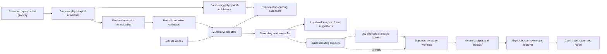

# Architecture and boundaries

The primary product is the team-lead monitoring dashboard: physiological summaries, source/time provenance, personal reference comparisons, inferred cognitive states, and charts. Work examples are secondary consumers of that same state. Monitoring continues independently of example workflow progress.

Signal sources own acquisition. Inference owns within-person normalization and state estimates. Monitoring exposes selected physical-unit summaries and timestamped history. Local wellbeing/focus suggestions apply illustrative rules to current state. Incident routing combines task requirements, capability, work context, and derived state; Jev selects among locally eligible candidates, and Gemini analyzes sample operational evidence. The browser renders the returned monitoring data and workflow state.

`ManualSignalSource` is a deliberate debug exception to physiological inference: it accepts the same derived `CognitiveState` directly. Its values never pretend to be recorded physiology, and it uses the exact same routing/orchestration path.

## Monitoring data and chart semantics

`snapshot.monitoring` exposes the source, units, current feature summaries, recording references, quality/status, and worker histories. The same two workers are used across monitoring and examples; additional employees or recordings are not invented for a tab.

Real UNIVERSE replay contains native 60-second feature summaries every 10 source seconds. Monitoring displays each actual source row directly, including missing values. Cognitive inference separately smooths up to three recent overlapping rows. Recomputed cognitive-history points use that inference method with the current staged work context; they are estimated trajectories, not observed historical diagnoses.

History includes only available rows at or before the replay cursor, with at most 90 points per worker. The main dashboard primes 120 seconds of existing replay history and starts at 10×. Recorded time is relative to each recording; it is not the date/time of a currently worn device. Live readings instead carry device timestamps. Chart series must not bridge source changes with fabricated observations.

Manual mode has no physiological feature values or history. A stale live source retains its real earlier history while current feature values become unavailable. Missing features are null/gaps, not zeros. The reference period is a numerical per-person calibration segment, not a healthy/normal range.

The English interface keeps metric meanings in a shared help dialog. Each entry gives a short definition and units, with calculation details and limitations collapsed initially. The guide covers physical signals, relative indices, quality/confidence, references, source windows, playback, and trends. Chart colors identify series; they do not classify physiological readings as healthy or unhealthy.

## Secondary examples and human control

The default tab is **Team overview**. **Breaks & wellbeing**, **Focus & meetings**, and **Incidents** are secondary views of the same current snapshot. Tab changes do not start work or change the source.

The incident example groups five dependent steps into three phases: **Investigate**, **Human decision**, and **Check & report**. A single current-action panel starts the investigation, requests diagnosis confirmation, requests recovery approval, or opens the completed report. Each step identifies its assigned owner and execution state. Full analysis and collapsed assignment/execution details expose the actual output and provider provenance. The wellbeing and focus examples use local illustrative recommendations and downloadable drafts; they do not schedule events or send notifications.

The pause example flags fatigue ≥60, load ≥70, or readiness <45. The focus example suggests an asynchronous update when interruption cost ≥60 or readiness <45. Both explain the rule using current state and require usable confidence. These thresholds are interface examples, not validated recommendations. Draft preparation is local browser state and invokes neither Jev nor Gemini.

An ordinary incident preserves the selected monitoring source and playback choice. Configured Jev and Gemini providers perform real requests in the executable incident flow. The developer API separately retains `run_demo`, which selects a synthetic fixture at accelerated playback, and `stress_aoi`, which applies an explicit Manual state through the same router. These controls are not part of the simplified incident tab.

Gemini's diagnosis draft does not complete the diagnosis task. The task remains active until the user selects **Confirm diagnosis**. The critical architecture decision then requires **Approve recovery plan**. Verification and documentation depend on that approval. These gates replace timer-based completion of human work.

The incident logs, deployment names, and recovery evidence are demonstration inputs. Model-produced analysis is real generated output, but it does not establish an actual production incident or a verified recovery. The app has no production database connector or mechanism for executing a proposed rollback.

## Background execution

Provider requests run as background work outside the API's shared state lock. Snapshot reads, WebSocket updates, and state controls can continue while a provider responds. Results are applied only to the relevant current workflow; reset invalidates older jobs so their eventual responses cannot mutate a new incident.

Completed AI artifacts preserve their provider/model provenance. Failed or unconfigured execution uses an explicitly labeled local fallback. Human review and approval remain necessary with either provider outcome. The guided workflow has no guaranteed completion time: network latency and the user's review actions are part of its duration.

## Scientific scope

This is a physiological-monitoring MVP with illustrative cognitive estimates and work examples, **not a validated cognitive assessment**. Heart-related variability and EDA can covary with arousal, motion, temperature, posture, task demands and many other factors. They do not identify fatigue, readiness or workload uniquely. The MVP's weighted mappings are illustrative hypotheses, not clinical measurements, probabilities of impairment or fitness-for-work judgments.

- Recorded feature windows and source provenance are observations/metadata.
- Within-person z-scores are mathematical normalization against a recorded calibration period.
- Cognitive load, readiness, fatigue and interruption cost are heuristic relative indices. Work context contributes to them.
- Confidence describes signal coverage/quality and policy certainty. It is not clinically calibrated accuracy.
- Work expertise, current task and availability are fictional scenario context.
- Synthetic demo windows are explicitly labeled and separate from UNIVERSE recordings.
- Changing an estimate triggers policy re-evaluation; it does not establish that a person is incapable of working.

A future trained estimator can implement the inference interface without replacing the signal adapters or the router. It would require consented data, held-out participant validation, artifact rejection, appropriate calibration, uncertainty evaluation, and deployment-specific validation.

## Privacy and deployment scope

Team-lead snapshots and the WebSocket intentionally include physiological summary features, selected reference values, time-series history, and inferred cognitive state. Full raw sensor waveforms and detailed private research diagnostics are separate. Device buffers remain in process memory; research inspection is disabled by default. Jev receives only allow-listed derived work context and task/candidate attributes. Gemini receives sample operational evidence and prior workflow artifacts. Enabling physiological summaries in the manager interface does not send those measurements or reference baselines to either external provider.

The MVP is a single-session local demo. The research flag is an environment gate, not a user authorization system. Before any shared or production deployment it needs authentication, role-based researcher access, TLS, device authentication, consent/retention policies, persistent audit storage, and tenant/session separation. Local startup binds services to loopback. Never expose the optional research endpoint on an untrusted network.

## Jev boundary

Jev is selected by default when configured, unless the local provider is explicitly selected. It receives only eligible assignments and chooses one through TypeSafe's [Choice API](https://docs.typesafe.ai/primitives/choice). A low-confidence, malformed, unknown, or failed response returns control to the deterministic policy. Network timeouts are bounded and failures open a retry circuit. Local expertise, availability, capacity, confidence, and human-judgment constraints remain in control.

The integration follows the official [TypeSafe quickstart](https://docs.typesafe.ai/introduction/quickstart): `POST /v1/systemone`, `state`, `model`, and a typed `questions` map. Provider responses are not treated as model-generated explanations: displayed factors come from the local policy.

## Gemini boundary

The Gemini executor receives a bounded task prompt with incident evidence and relevant preceding artifacts. It returns text for evidence analysis, diagnosis support, recovery-evidence review, and documentation. It has no shell, deployment, database, email, or other action tool. Its result cannot waive a workflow dependency or human approval gate.

The API records model, provider, execution status, and latency where available. A remote error produces a safe status message and a `local_fallback` artifact; it must not be labeled as Gemini-generated work. A successful artifact is evidence that a model call completed, not evidence that its reasoning is correct. Human review remains necessary.
